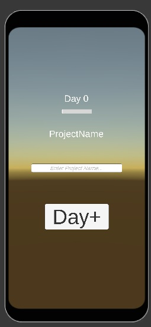

### 5월 27일 업데이트
- 직원 메인데이터(Employee) 오브젝트 생성 방식으로 전환

# 회사 데이터
## Company.cs (싱글톤)
- 날짜: day (int)
- 돈: gold (int)
- 단계: level (int) → 프로젝트 규모 잠금 해제
- 진행중인 프로젝트: Projects (Project[])
---

# 프로젝트 데이터
## 초기값 데이터 - ProjectSO.cs
- id (int)
- 이름: Name (string)
- 설명: desc (string)
- 규모: ProjectScale (enum) → Small / Medium / Large
- 개발비: requiredCost (int)
- 파트별 최대 투입 인원: maxEmployeePerPart (int)
- 개발 기간: durationDays (int)
- 목표 점수: goalScore (float)

## 런타임 데이터 - Project.cs
- SO 참조: so (ProjectSO)
- 현재 진행 일수: day (int)
- 유저가 지은이름: userNamed (string)
- 투입 직원: plannings / develops / arts (Employee[]) ← maxEmployeePerPart 크기로 Start에서 초기화
  - AssignEmployee(Employee) 메서드로 파트(so.partParsed) 기준 빈 슬롯에 자동 배치
- 진행도: progress (float) → 기본 0(시작) ~ goalScore(목표) → 0~100% 으로 표시
  - 완성도 점수: qualityScore (float) → 기획 파트 담당
  - 안정성 점수: stabilityScore (float) → 개발 파트 담당
  - 매력도 점수: charmScore (float) → 아트 파트 담당
  - 이벤트 가중치 누적: 미구현
- isFinished (bool)

## 완료 프로젝트 데이터 - TODO (추후 완성 필요)
- 갓겜등급: grade (enum) → S / A / B / C
- 매출 (데일리 캐시) / 밤에 매출 그래프 확인(완성도/안정성/매력도에 영향)
- 유지비 및 사후관리 보고서 + 서비스 종료 시스템
- 명성 / 커뮤니케이션 시스템
---

# 직원 데이터
## 초기값 데이터 - EmployeeImmutableData.cs (ScriptableObject)
- id (int)
- 이름: employeeName (string)
- 등급: rankParsed (Rank enum) → S / A / B / C
- 직군: partParsed (Part enum) → Develop / Planning / Art / Marketing / QA
- MBTI: mbtiParsed (MbtiFlags enum) → Flags 방식
- 계약금: contractGold (int)

## 런타임 데이터 - EmployeeMutableData.cs (struct)
- 주 능력치: baseStat (int) → Rank에 따라 초기값 결정 (PerkPolicy 참조)
- 세부 능력치 (기본값 = 20 + stat * 0.5):
  - property1 / property2 / property3 (int)
  - bonus1 / bonus2 / bonus3 (int) → 특성·이벤트 등으로 인한 추가 변동값
- 의욕: motivation (int) → 기본 50
- 충성도: loyalty (int) → 기본 50
- 피로도: fatigue (int) → 기본 0

## 직원 게임오브젝트 - Employee.cs (MonoBehaviour)
- 초기값 SO 참조: so (EmployeeImmutableData) → 프리팹 인스펙터에서 할당
- 가변 데이터: MutableData (EmployeeMutableData)
- Init() → so 기반으로 MutableData 초기화 (Instantiate 직후 호출)
- UpdateStat(int) / UpdateBonus(int,int,int) → 능력치 변경 후 세부값 재계산
- IPointerClickHandler 구현

## 핵심 관리 - _EmployeeManager.cs (싱글톤)
- allEmployeeObj (GameObject[]) → 모든 직원 원본 프리팹 배열 (인스펙터 할당)
  - DB 접근 = 프리팹의 Employee.so(EmployeeImmutableData) 를 통해 이루어짐
- EmployeeList → id 기준 전체/미고용 직원 딕셔너리 관리 (GameObject 단위)
- HaveEmployees → 고용된 Employee 인스턴스 목록
- HireEmployee(id)
  1. leftEmployees에서 해당 id의 프리팹 조회
  2. Instantiate → Company.Instance의 자식으로 소환
  3. Employee.Init() 호출로 MutableData 초기화
  4. HaveEmployees에 추가, EmployeeList에서 제거
---

# 세이브 데이터 - SaveData.cs → 직렬화 로직 미구현
- 프로젝트 진행상황: Project[] projects (후에 Company 연동)
- 회사 데이터: Day, Gold, Level
- (미구현) 직원 상태 저장 항목 필요

---

# 프로젝트 데이터 흐름 테스트 씬 작성
- WIP/PEY/ProjectProcess.unity 테스트 씬 작성

Day+ 버튼을 클릭하여 로그와 흐름파악

# 참고용 데이터 흐름 정리 (구버전)
## 프로젝트 시작 흐름
```
[플레이어] 빈 프로젝트 슬롯 선택
  → 프로젝트 이름 입력 (한/영, 한글 6자 제한)
  → 개발 규모 선택 (처음에는 작은것만 가능)
      → ProjectSO에서 requiredCost / maxEmployeePerPart / durationDays 로드
      → Company.money >= requiredCost 검증
  → 직군별 직원 배치 (기획/개발/아트 각 1명 이상 필수)
      → Employee[] → Project.plannings / develops / arts 할당
  → 개발비 차감: Company.money -= requiredCost
  → Project 생성 → Company에 등록
```

## 낮(주중) 수치 반영 흐름
```
[대화 이벤트 실행]
  → 대화시 직원 대화여부(예:Employee.hasConversedThisWeek = true) 기록 
  → 대화 이벤트 및 변동 스텟 산출
  → 해당 주차 직군별 가중치 누적 (복수 수행 시 평균값으로 계산)
  → 금요일 밤 정산 시 완성도/안정성/매력도에 반영
```

## 금요일 밤 정산 흐름
```
[1단계] 직원 주간 코멘트 출력
  → 의욕/피로도/충성도/대화여부 조건 → 코멘트 프리셋 결정
  → 미대화 직원: loyalty -= 5, 다음주 fatigue += 10 예약

[2단계] 직군별 보고서 채택
  → 직군별 직원 수만큼 보고서 카드 생성
  → 보고서 점수 계산:
      직원 기본점수 = 20 + 능력치 × 0.5
      의욕 가중치: motivation >= 80 → +5 / 40~79 → 0 / < 40 → -10
      보고서 등급 결정: 70↑ → 1등급 / 45~69 → 2등급 / 44↓ → 3등급
  → 등급별 특성 효과 적용 (대표/보조/리스크 특성)
      1등급: 피로도+5, 대표특성+12, 보조특성+6, 리스크특성-6
      2등급: 피로도+15, 대표특성+8, 보조특성+4, 리스크특성-4
      3등급: 피로도+15, 대표특성+4, 보조특성+2, 리스크특성-2
  → 최종 점수 공식: A + (100 - A) × (보고서효과점수 / 100)
  → 직군별 3개 수치 평균 → 완성도 / 안정성 / 매력도 누적 반영

[3단계] 개인 작업 의견 시스템
  → 전체 직원 중 1~2명 랜덤 선정
  → 안건 등급 산출:
      능력치 구간별 기본 확률 (2~5등급)
      충성도 수치 / 10 만큼 최하등급 확률을 1등급으로 이동
  → 플레이어 승인/반려 선택
  → 성공확률: 1등급 100% / 2등급 80% / 3등급 60% / 4등급 40% / 5등급 20%
  → 결과(능력치/의욕 변화)는 다음주 경영 업무 전 반영
```
